# 🏛️ Arquitectura del Sistema y Estructura del Código

Este documento describe en profundidad la arquitectura técnica, los lenguajes de programación, las tecnologías y dependencias utilizadas, así como la estructura completa del árbol de archivos del **Recuperador de Datos Forense (Forensic Data Recovery Suite)**.

---

## 1. Lenguajes y Tecnologías Utilizadas

| Componente / Capa | Tecnología / Lenguaje | Propósito y Función |
|---|---|---|
| **Lenguaje Central** | **Python 3.10 - 3.14** | Lenguaje de desarrollo principal. Se aprovecha su tipado estático opcional (`typing`), manejo nativo de flujos binarios (`io`, `struct`, `bytes`) y concurrencia segura con hilos de ejecución. |
| **Framework de Interfaz Gráfica** | **PyQt5 (Qt 5.15+)** | Construcción de la interfaz de usuario de alto rendimiento con aceleración por hardware, escalado automático High-DPI (`AA_EnableHighDpiScaling`), renderizado de video (`QtMultimedia`, `QVideoWidget`) y estilos visuales QSS basados en temas oscuros modernos. |
| **Capa de Persistencia Relacional** | **SQLite 3 (Embebido)** | Base de datos local transaccional (`data/recovery_vault.db`) autoconstruida mediante DDL relacional. Almacena el catálogo de software indexado, historiales de auditoría y metadatos de configuración sin requerir servicios externos. |
| **Serialización de Sesiones** | **JSON + Base64 RFC 4648** | Sistema de guardado y carga de sesiones de exploración (`sessions/*.json`), permitiendo reanudar hallazgos entre reinicios de sistema sin reescanear discos físicos. Incluye codificación Base64 para muestras binarias de previsualización. |
| **Interoperabilidad de Bajo Nivel** | **Ctypes / Win32 API / Native CLI** | Interacción con APIs del kernel de Windows: verificación de privilegios UAC (`Shell32.IsUserAnAdmin`), detección de volúmenes NTFS/FAT32/exFAT (`GetVolumeInformationW`, `GetDiskFreeSpaceExW`), e invocación segura de herramientas del sistema (`vssadmin` para Shadow Copies). |
| **Compatibilidad Multiplataforma** | **POSIX / Linux XDG / FreeDesktop** | Abstracción de sistema operativo que permite ejecutar la suite en **Linux (Bazzite, Debian, Ubuntu, Fedora, SteamOS)**, leyendo puntos de montaje desde `/proc/mounts`, papelera FreeDesktop en `~/.local/share/Trash` y variables XDG de usuario. |
| **Procesamiento Gráfico Forense** | **Pillow (PIL 10+)** | Análisis de dimensiones, resolución de imágenes (2K/4K/8K), decodificación de metadatos EXIF fotográficos, y generación dinámica de miniaturas en memoria para el visor visual interactivo. |
| **Compilador y Empaquetador** | **PyInstaller (6.0+)** | Generación de ejecutables autónomos portables (`RecuperadorDeDatos.exe` en Windows y binario ELF nativo en Linux) que empaquetan el intérprete de Python, las bibliotecas C++ compartidas y las dependencias gráficas en un archivo único independiente. |
| **Scripts de Automatización** | **PowerShell, Windows Batch (.bat), Bash (.sh)** | Lanzadores estándar, lanzadores con elevación de privilegios UAC y scripts de compilación desatendida. |

---

## 2. Diagrama de Arquitectura del Software

```mermaid
graph TD
    subgraph UI ["Capa de Presentación e Interfaz (PyQt5)"]
        MW[MainWindow] --> IB[InfoBar HUD Telemetría]
        MW --> SP[ScanPanel Selector y Filtros]
        MW --> RT[ResultsTable Tabla y Checkboxes]
        MW --> PW[PreviewWidget Visor Forense 5 Pestañas]
        MW --> SD[SessionDialog Gestor de Sesiones]
        SP --> PD[Popups Dialogs: Tipos, Protocolos, Carpetas]
    end

    subgraph WORKERS ["Capa Asíncrona Concurrente (QThread)"]
        SW[ScanWorker Hilo de Escaneo]
        EW[ExportWorker Hilo de Restauración]
    end

    subgraph CORE ["Motores Lógicos y Forenses (core/)"]
        DU[disk_utils Detección de Discos]
        CR[context_router Ruteo por Formato]
        SF[software_filter Exclusión de Juegos]
        IA[integrity_analyzer Calidad y Entropía]
        FC[file_carver Carving Estructural]
        RB[recycle_bin Papelera e Índices $I/$R]
        MS[mft_scanner Analizador NTFS MFT]
        SE[shadow_explorer Copias de Sombra VSS]
        TE[thumbcache_extractor Caché Gráfica]
        TS[temp_scanner Borradores Office y Temp]
        SM[session_manager Persistencia JSON]
        EX[exporter Restaurador de Árbol y Nombres]
    end

    subgraph STORAGE ["Capa de Almacenamiento Local y Físico"]
        DB[(recovery_vault.db SQLite)]
        SESS[(Carpeta sessions/ JSON)]
        RAW[Sectores Físicos / Volúmenes HDD/SSD/USB]
        DEST[Directorio de Destino Seguro]
    end

    MW --> SW
    MW --> EW
    SW --> CORE
    EW --> EX
    EX --> DEST
    CORE --> RAW
    SM --> SESS
    SF --> DB
```



---

## 3. Estructura Exhaustiva de Carpetas y Módulos

```
RECUPERADOR DE DATOS/
├── main.py                         # Punto de entrada principal con detección High-DPI y arranque
├── build_exe.py                    # Compilador automatizado a ejecutable único (.exe) para Windows
├── build.bat                       # Script por lotes para compilar con un solo doble clic en Windows
├── build_linux.sh                  # Script Bash para compilar binario nativo en Linux/Debian/Bazzite
├── run.bat                         # Lanzador en modo usuario estándar
├── run_as_admin.bat                # Lanzador con elevación UAC de Administrador para Windows
├── run_linux.sh                    # Lanzador para distribuciones Linux
├── requirements.txt                # Lista de librerías requeridas (PyQt5, Pillow, pyinstaller)
├── RecuperadorDeDatos.spec         # Fichero de especificación técnica generado por PyInstaller
├── RecuperadorDeDatos.desktop      # Acceso directo para el menú de aplicaciones en Linux (KDE/GNOME)
│
├── core/                           # Capa de Motores Lógicos y Protocolos Forenses
│   ├── __init__.py                 # Exportación de módulos centrales
│   ├── disk_utils.py               # Enumeración de discos físicos/lógicos, espacio libre, permisos y formateo
│   ├── local_db.py                 # Gestor SQLite local con creación automática de tablas e índices
│   ├── env_checker.py              # Diagnóstico preventivo Win32 (.NET, Visual C++, arquitecturas x64)
│   ├── integrity_analyzer.py       # Evaluación forense de usabilidad, entropía de Shannon y ratio nulo
│   ├── file_carver.py              # Motor de tallado estructural con validación matemática de longitud
│   ├── mft_scanner.py              # Analizador de Master File Table (MFT) en sistemas de archivos NTFS
│   ├── shadow_explorer.py          # Extractor de instantáneas de volumen (Volume Shadow Copies - VSS)
│   ├── recycle_bin.py              # Parser de Papelera Forense ($Recycle.Bin), registros $I y huérfanos $R
│   ├── thumbcache_extractor.py     # Extractor de fotos en alta resolución desde bases de datos thumbcache
│   ├── temp_scanner.py             # Escáner de borradores no guardados de Office (.asd, .wbk) y temporales
│   ├── session_manager.py          # Gestor de persistencia de sesiones, huellas digitales y escaneo diferencial
│   ├── context_router.py           # Ruteo contextual y mapeo inteligente de directorios por tipo de archivo
│   ├── software_filter.py          # Filtro inteligente de exclusión de software, dependencias y videojuegos
│   └── exporter.py                 # Motor de exportación segura, reconstrucción de árbol y verificación SHA-256
│
├── ui/                             # Capa de Interfaz Gráfica de Usuario (PyQt5)
│   ├── __init__.py                 # Inicializador de paquete UI
│   ├── main_window.py              # Ventana principal, orquestación de eventos, HUD y seguridad al exportar
│   ├── info_bar.py                 # Barra HUD de telemetría en tiempo real (velocímetro, cronómetro, contadores)
│   ├── scan_panel.py               # Panel lateral de configuración de escaneo, alcance y protocolos
│   ├── popups.py                   # Diálogos emergentes: FileTypesDialog, FolderChecklistDialog, etc.
│   ├── results_table.py            # Tabla interactiva con badges de calidad, ordenamiento numérico y filtros
│   ├── preview_widget.py           # Visor multi-pestaña (Imagen con zoom/pan, Video/Audio, Texto, HexDump, Metadatos)
│   ├── session_dialog.py           # Diálogo de gestión, carga, nombrado y borrado de sesiones previas
│   ├── directory_selector.py       # Selector de alcance (Indexación dirigida, manual o unidad entera)
│   ├── worker.py                   # Hilos asíncronos QThread (ScanWorker para análisis, ExportWorker para volcado)
│   └── theme.py                    # Hoja de estilos Qt QSS con paleta oscura profesional (GitHub Dark inspirada)
│
├── data/                           # Directorio de persistencia local
│   └── recovery_vault.db           # Base de datos SQLite local autoconstruida
│
├── sessions/                       # Catálogo de sesiones guardadas
│   └── *.recovery_session.json     # Archivos JSON estructurados con resultados, huellas y muestras base64
│
├── dist/                           # Salida de ejecutables compilados
│   ├── RecuperadorDeDatos.exe      # Ejecutable portable 100% autónomo para Windows (256 MB)
│   └── RecuperadorDeDatos          # Binario ELF nativo para Linux (cuando se compila en Linux)
│
├── docs/                           # Documentación oficial del proyecto
│   ├── ARQUITECTURA_Y_ESTRUCTURA.md # Este documento de arquitectura técnica
│   ├── CHANGELOG.md                # Registro de cambios cronológico detallado
│   ├── COMPILACION_Y_DISTRIBUCION.md # Guía para compilar ejecutables en Windows y Linux
│   ├── MANUAL_USUARIO_COMUN.md     # Guía paso a paso para usuarios finales
│   ├── MANUAL_TECNICO_Y_FORENSE.md # Manual especializado para técnicos y peritos
│   └── MANUAL_DESARROLLADOR_Y_PORTING.md # Guía para programadores y adaptaciones multiplataforma
│
└── tests/                          # Batería de pruebas automatizadas
    └── test_core.py                # 9 suites de pruebas forenses y de integración central
```

---

## 4. Descripción Funcional de los Módulos Principales

### 4.1 Módulos Centrales (`core/`)

* **`file_carver.py`**: Motor de tallado binario estructural. En lugar de limitarse a buscar cadenas de bytes iniciales, implementa parsers específicos que interpretan la especificación formal del formato para calcular la longitud en bytes exacta del archivo:
  * *JPEG*: Recorre marcadores `SOI`, `APPx`, `DQT`, `DHT`, `SOF0/2` y el flujo `SOS` omitiendo miniaturas EXIF para no cortar la imagen prematuramente.
  * *PNG*: Valida matemáticamente cada chunk mediante CRC32 hasta encontrar el bloque final `IEND`.
  * *MP4 / MOV*: Navega la jerarquía de cajas ATOM (`ftyp`, `moov`, `mdat`) y extrae duración y resolución.
  * *RIFF*: Extrae audio PCM (WAV), imágenes WebP (VP8/VP8L/VP8X) y video AVI delimitando el tamaño exacto.
  * *ZIP / OOXML / ODF*: Detecta firmas `PK\x03\x04`, parsea el directorio central (`EOCD`) y diferencia documentos Word (`.docx`), Excel (`.xlsx`), PowerPoint (`.pptx`), LibreOffice (`.odt`, `.ods`, `.odp`) y libros digitales (`.epub`).
  * *Identificadores Criptográficos*: Cada elemento tallado recibe un ID unívoco mediante hash MD5 (`carved_{md5}`), evitando colisiones de selección en la interfaz.

* **`integrity_analyzer.py`**: Analizador de viabilidad forense. Aplica análisis estadístico y estructural a cada archivo antes de presentarlo al usuario:
  * *Ratio de bytes nulos (`0x00`)*: Si supera el 85%, califica el archivo como sector borrado o bloque nulo (puntaje $\le 5\%$, estado `🔴 Inútil`).
  * *Entropía de Shannon*: Evalúa la distribución aleatoria de la información binaria para descartar ruido sin estructura.
  * *Validación de dimensiones y duración*: Penaliza iconos diminutos del sistema ($\le 64\times 64$) y microfragmentos multimedia ($< 1$ segundo), premiando archivos útiles en alta definición.
  * *Calificación en 4 niveles*: 🌟 Alta Calidad ($\ge 80\%$), 🟡 Media ($\ge 50\%$), 🟠 Baja ($\ge 20\%$) y 🔴 Inútil ($< 20\%$).

* **`local_db.py`**: Abstracción sobre SQLite 3. Asegura que el archivo `data/recovery_vault.db` se cree automáticamente en la primera ejecución con tablas e índices optimizados:
  * `sessions`: Registro histórico de sesiones de búsqueda.
  * `recovered_items`: Detalle de elementos recuperados y sus metadatos.
  * `software_catalog`: Rutas de juegos y programas instalados para exclusión inmediata.
  * `export_audit`: Registro de auditoría de restauraciones realizadas con firmas SHA-256.
  * `app_config`: Claves y valores de configuración del usuario.

* **`env_checker.py`**: Verificador de dependencias del sistema operativo antes de inicializar la interfaz Qt. Si detecta la falta de librerías C++ Redistributable o .NET en Windows, despliega una alerta nativa Win32 (mediante `ctypes.windll.user32.MessageBoxW`) con hipervínculos de descarga oficial.

* **`mft_scanner.py`**: Analizador forense de la tabla maestra de archivos (MFT) en volúmenes NTFS. Parsea registros de 1024 bytes buscando la firma `FILE`, analiza cabeceras de atributos (`$STANDARD_INFORMATION`, `$FILE_NAME`, `$DATA`), y recupera nombres de archivo originales, marcas temporales y datos residentes sin depender de que el archivo exista en el explorador.

* **`shadow_explorer.py`**: Gestor de Copias de Sombra de Volumen (Volume Shadow Copies - VSS). Consulta instantáneas creadas por Windows y permite restaurar versiones previas de archivos que fueron modificados o sobreescritos.

* **`recycle_bin.py`**: Parser profundo de la papelera de reciclaje (`$Recycle.Bin`). Asocia archivos de metadatos `$I` (que conservan nombre original, fecha de eliminación y tamaño) con sus respectivos contenedores `$R`. Adicionalmente, cuenta con un algoritmo de rescate de huérfanos `$R` que identifica el tipo de archivo mediante números mágicos si los índices `$I` fueron eliminados.

* **`thumbcache_extractor.py`**: Extractor de imágenes en alta definición (hasta 1080p y 4K) contenidas en los ficheros de base de datos `thumbcache_*.db` de Windows Explorer. Permite rescatar fotos familiares o de trabajo aun cuando el archivo original en disco haya sido completamente sobreescrito.

* **`temp_scanner.py`**: Localizador especializado en archivos de trabajo no guardados y borradores automáticos de suites ofimáticas (Microsoft Word `.asd`, Excel `.xar`, temporales `.tmp` con firma válida y respaldos `.wbk`).

* **`session_manager.py`**: Administrador de persistencia en formato JSON. Incluye cálculo de huellas digitales (*fingerprints*) para permitir escaneos incrementales y diferenciales, omitiendo archivos conocidos sin cambios y fusionando novedades.

* **`context_router.py`**: Enrutador heurístico que asocia las categorías buscadas (Documentos, Imágenes, Audio, Video, etc.) con los directorios donde habitualmente residen, acelerando el escaneo al omitir carpetas no pertinentes.

* **`software_filter.py`**: Catálogo inteligente que consulta el Registro de Windows y carpetas típicas (`C:\Games`, Steam, Epic, etc.) para excluir miles de archivos irrelevantes de juegos y aplicaciones (texturas, shaders, DLLs, paquetes `.pak`), ahorrando hasta un 85% de tiempo de análisis.

* **`exporter.py`**: Motor de restauración a disco. Dispone de opciones para preservar nombres reales originales, reconstruir el árbol de directorios original (jerarquía de carpetas y subcarpetas) y generar un reporte de auditoría forense con hashes criptográficos SHA-256.

---

### 4.2 Módulos de Interfaz Gráfica (`ui/`)

* **`main_window.py`**: Ventana principal del sistema. Conecta los paneles, coordina los hilos asíncronos y contiene los mecanismos de seguridad al exportar (advertencia de misma unidad física y confirmación selectiva de archivos visibles frente a selecciones ocultas).
* **`info_bar.py`**: Barra de telemetría (HUD) superior. Muestra cronómetro de análisis, velocímetro en megabytes por segundo, volumen total procesado y desgloses de hallazgos por categoría en tiempo real.
* **`popups.py`**: Diálogos modales desplegables compactos (`FileTypesDialog`, `FolderChecklistDialog`, `ProtocolDialog`) que reemplazan controles invasivos, manteniendo una interfaz limpia y profesional. Contiene los catálogos exhaustivos de 82 formatos categorizados.
* **`results_table.py`**: Tabla de presentación de resultados. Soporta ordenamiento numérico real (por bytes y porcentaje de calidad), filtrado interactivo por texto, categoría, extensión y calidad, badges visuales en color y cálculo transparente de estadísticas (archivos visibles vs. lote global).
* **`preview_widget.py`**: Panel de previsualización integral con 5 pestañas:
  1. *Vista Gráfica*: Zoom libre (10% a 800%), paneo, lectura de metadatos EXIF fotográficos.
  2. *Multimedia*: Reproductor audiovisual integrado (`QMediaPlayer` + `QVideoWidget`) con barra de progreso deslizable.
  3. *Texto / Documentos*: Extracción y visualización de texto legible en documentos Office, código y texto plano.
  4. *Volcado Hexadecimal*: Vista estilo editor hexadecimal con panel ASCII, detección de firmas mágicas y cálculo de entropía de Shannon.
  5. *Metadatos y Hash*: Tabla detallada de especificaciones técnicas y cálculo de SHA-256 bajo demanda.
* **`worker.py`**: Implementación de concurrencia mediante `QThread` (`ScanWorker` y `ExportWorker`), garantizando que la interfaz nunca se congele durante el análisis de gigabytes de datos en disco.
* **`theme.py`**: Definición central de la hoja de estilos Qt QSS con paleta oscura de alto contraste, garantizando una estética moderna en cualquier resolución.

