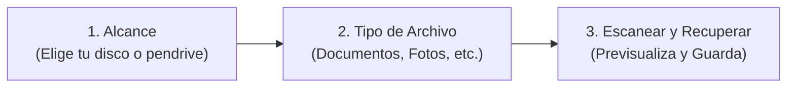

# 🧪 Guía de Bienvenida e Introducción para Evaluadores (Beta Testers)

¡Te damos la bienvenida a la fase de evaluación de **Forensic Data Recovery Suite (Deep Recovery Edition)**!

Este documento ha sido preparado especialmente para ti como **Beta Tester**. Su objetivo es explicarte de manera clara, transparente y directa qué herramienta tienes en tus manos, cómo funciona en la práctica, qué esperar de sus resultados reales y cuáles son los componentes que aún se encuentran en fase activa de desarrollo.

---

## 1. 🛡️ ¿Qué herramienta estás probando?

**Forensic Data Recovery Suite** es una suite de rescate y análisis forense de datos desarrollada para entornos Windows. 

A diferencia de las herramientas convencionales que solo leen el sistema de archivos activo o que requieren instalar software pesado y servicios en segundo plano, esta suite opera como un **ejecutable portable y 100% autónomo**, diseñado bajo los principios de la informática forense:
* **Lectura No Destructiva**: Opera en modo de solo lectura sobre las unidades analizadas, garantizando que nunca se sobreescriba ni se altere el disco donde se perdieron los datos.
* **Aislamiento Estricto de Unidades**: Si seleccionas una memoria USB específica (por ejemplo `H:\`), el motor aísla el análisis exclusivamente a esa unidad, impidiendo que se mezclen archivos de tu disco duro principal o de otros dispositivos externos.
* **Enfoque Multicapa**: Combina 5 métodos de investigación forense independientes para maximizar las probabilidades de rescate.

---

## 2. ⏳ Sobre esta Versión de Prueba (DEMO 24 Horas)

Esta compilación que vas a evaluar corresponde a la **edición de prueba portable (`Forensic_Recovery_DEMO.exe`)**:
* **Temporizador de 24 Horas**: Dispones de 24 horas completas de uso a partir del primer segundo en que abres la aplicación en tu equipo para probar todas sus funciones.
* **Autonomía y Limpieza**: Al cumplirse el período de 24 horas, la aplicación te informará que la prueba ha concluido y procederá a autolimpiarse/autodestruirse para no dejar archivos residuales en tu máquina.
* **Soporte para Futuras Versiones Beta**: Si el equipo de desarrollo publica una nueva versión de prueba previa al lanzamiento comercial (por ejemplo, una Beta 2 o Release Candidate), podrás ejecutarla en esta misma máquina para evaluar las nuevas características con un nuevo ciclo de prueba.
* **Modo Evaluación**: La vista previa y el análisis de integridad están 100% habilitados para que puedas verificar con tus propios ojos si tus archivos son recuperables y legibles.

---

## 3. 🚀 Funcionamiento Rápido en 3 Pasos Simples

El flujo de trabajo ha sido diseñado para ser completamente intuitivo sin requerir conocimientos técnicos:

1. **Paso 1: Selecciona el Alcance (¿Dónde buscar?)**
   * En el panel izquierdo verás la lista de carpetas y unidades conectadas.
   * Si buscas en un pendrive o disco externo, selecciónalo y pulsa el botón **`[🎯 Solo Esta]`** (o haz doble clic sobre él) para desmarcar automáticamente cualquier otra unidad y evitar análisis innecesarios.
2. **Paso 2: Selecciona los Tipos de Archivo (¿Qué buscas?)**
   * Marca las categorías que necesitas rescatar: *Documentos*, *Imágenes*, *Audio*, *Video*, *Comprimidos* o *Bases de Datos*.
   * Al seleccionar una categoría, puedes desplegar la lista de extensiones específicas (por ejemplo, solo `.docx` y `.pdf`).
3. **Paso 3: Inicia el Escaneo y Recupera**
   * Deja seleccionado el **Protocolo Forense Profundo** (recomendado) y pulsa **Iniciar Escaneo**.
   * Observa la telemetría en tiempo real en la barra superior.
   * Al finalizar, haz clic sobre cualquier archivo de la tabla para ver su **vista previa en vivo** (las fotos se visualizan, el audio se escucha y los documentos muestran su texto o cabeceras).
   * Marca los archivos que deseas conservar y pulsa **Recuperar Seleccionados** eligiendo tu carpeta de guardado.

---

## 4. 🔬 Las 5 Fases de Recuperación que Ejecuta la Suite

Cuando ejecutas el escaneo profundo, la herramienta activa de forma secuencial 5 motores forenses:

1. **Fase 1: Papelera Forense y Huérfanos `$R`**: Inspecciona los contenedores ocultos `$Recycle.Bin` de la unidad objetivo y procesa los índices metadatos `$I` para rescatar los nombres originales, fechas y rutas antes del borrado.
2. **Fase 2: Rescate en Caché Gráfica (`Thumbcache 1080p/4K`)**: Si se analiza la unidad de sistema, extrae miniaturas de alta definición de fotografías que estuvieron en pendrives o discos externos, incluso si el dispositivo original fue extraviado o formateado.
3. **Fase 3: Borradores de Office y Temporales**: Rastreará archivos de auto-recuperación (`~WRL*.tmp`, `.asd`, `.wbk`, `.xar`) creados por Word, Excel o PowerPoint tras apagones accidentales o cierres sin guardar.
4. **Fase 4: Análisis Directo de Registros NTFS `$MFT`**: Cuando se ejecuta con permisos de Administrador en discos NTFS, consulta directamente la Tabla Maestra de Archivos buscando entradas con marca de eliminación (`InUse = False`), recuperando datos residentes directamente de los descriptores.
5. **Fase 5: File Carving Estructural**: Rastreador de firmas mágicas en bruto (cabeceras binarias y pies de archivo) sobre imágenes de disco (`.raw`, `.dd`, `.img`, `.iso`, `.vhd`) para recomponer archivos cuando el sistema de archivos está destruido.

---

## 5. 📊 Análisis con RESULTADOS REALES (Transparencia Total)

> [!IMPORTANT]
> **La Verdad Técnica sobre la Recuperación de Datos**:
> Ninguna herramienta en el mundo —ni comercial ni de agencias de inteligencia— puede garantizar un 100% de éxito en todos los escenarios. Cuando un archivo se elimina, los clústeres donde estaba guardado quedan marcados como "espacio libre". Si Windows o cualquier aplicación escribe nueva información encima de esos sectores, los datos originales se destruyen físicamente.

A continuación te presentamos las **tasas reales de recuperación** que puedes esperar en tus pruebas según cada escenario:

| Escenario de Pérdida de Datos | Método Principal Utilizado | Tasa Real de Éxito | Qué Resultado Puedes Esperar |
| :--- | :---: | :---: | :--- |
| **Archivos vaciados de Papelera recientemente** | Papelera Forense & Huérfanos `$R` | **90% – 100%** | Archivos perfectos, con su nombre original, fecha y estructura intacta. |
| **Documentos cerrados sin guardar o tras apagón** | Borradores Office & `%TEMP%` | **80% – 95%** | Recuperación íntegra del contenido del documento desde la copia temporal. |
| **Fotos en pendrive dañado o borrado reciente** | Thumbcache + MFT / FAT | **80% – 95%** | Las fotos se rescatan en alta resolución directamente de los registros o de la caché. |
| **Archivos borrados hace días en discos mecánicos (HDD)** | Registros NTFS `$MFT` | **65% – 85%** | Alta probabilidad de éxito si el disco no sufrió escrituras pesadas de datos nuevos. |
| **Discos formateados rápido (Quick Format)** | File Carving en imágenes forenses | **50% – 75%** | Se rescatan fotos, PDFs y documentos contiguos. Nombres originales pueden perderse. |
| **Archivos muy fragmentados sin sistema de archivos** | File Carving Estructural | **35% – 60%** | Archivos contiguos (como JPG/PDF) abren bien; vídeos o zips divididos pueden truncarse. |
| **Discos de estado sólido (SSD) con TRIM activo** | Escaneo directo de sectores | **10% – 30%** | Los SSD modernos ejecutan el comando TRIM tras borrar, reemplazando los sectores por ceros electrónicos. Sin embargo, los metadatos y copias de sombra VSS aún pueden rescatar datos. |
| **Archivos borrados hace meses en discos de uso diario** | Todos los métodos | **15% – 35%** | La sobreescritura natural de Windows y programas suele haber pisado parte de los clústeres. |

### Medidor de Calidad e Integridad Integrado:
Para evitar que pierdas tiempo abriendo archivos dañados, la suite incluye un **Analizador de Integridad** que califica cada archivo encontrado con una etiqueta de color:
* 🌟 **Alta (Verde)**: Cabecera perfecta, tamaño congruente y entropía normal. Abrirá sin problemas en tu programa habitual.
* 🟡 **Media (Amarillo)**: Archivo recuperable pero con posibles sectores truncados al final.
* 🟠 **Dañada (Naranja)**: Se detectaron anomalías binarias severas; puede requerir herramientas de reparación especializadas.
* 🔴 **Inútil (Rojo)**: Sectores de ceros o ruido puro. El motor los filtra para evitarte falsos positivos.

---

## 6. 🚧 Partes de la Herramienta que Están en Desarrollo Activo (Beta / WIP)

Al tratarse de una versión preliminar de prueba, queremos que conozcas los aspectos que nuestro equipo se encuentra refinando:

1. **Interfaz de Usuario (UI) y Fluidez Visual**:
   * La UI actual es totalmente funcional y cuenta con soporte para resoluciones High-DPI y pantallas 4K.
   * *En desarrollo:* La vista de galería de miniaturas masiva (modo cuadrícula para miles de fotos simultáneas) y la personalización de temas visuales claro/oscuro están en proceso de optimización.
2. **Tiempos de Lectura en Puertos USB Lentos**:
   * En unidades extraíbles USB 2.0 antiguas o discos con sectores físicos defectuosos (bad sectors), la velocidad de lectura física puede reducir la tasa de escaneo a 5–15 MB/s. La suite implementa control de timeout para no congelarse, pero el proceso puede tomar más tiempo.
3. **Privilegios de Administrador vs. Usuario Estándar**:
   * Si ejecutas la herramienta como usuario estándar (sin "Ejecutar como Administrador"), Windows bloquea el acceso directo al sector 0 del disco (`\\.\PhysicalDrive`).
   * La suite detecta esto automáticamente y utiliza métodos de usuario (`$Recycle.Bin`, `%TEMP%`, Thumbcache y VSS), pero para el análisis profundo de la `$MFT` física se recomienda ejecutarla con permisos elevados.
4. **Archivos Gigantes (> 4 GB) en Modo Carving**:
   * El tallado estructural de vídeos de gran volumen (archivos `.mp4` o `.mkv` de varios gigabytes) puede experimentar desincronización si el archivo original estaba muy fragmentado en varios sectores no contiguos.

---

## 7. 💬 ¿Qué Feedback Esperamos de Ti?

Tu experiencia como evaluador es fundamental para nosotros. Te agradeceríamos especialmente que nos comentes:

1. **Facilidad de uso**: ¿Fue claro y cómodo seleccionar las unidades y tipos de archivo?
2. **Precisión de resultados**: ¿Pudiste encontrar el archivo que buscabas? ¿Abrió correctamente en Word, Excel, visor de fotos o reproductor?
3. **Estabilidad**: ¿Experimentaste algún bloqueo, lentitud extrema o mensaje de error inesperado?
4. **Sugerencias**: ¿Qué funcionalidad o botón adicional te gustaría ver en la versión comercial definitiva?

---

*¡Gracias por formar parte del equipo de evaluadores de Forensic Data Recovery Suite!*  
*Si necesitas asistencia técnica, claves de extensión de prueba para laboratorio o deseas adquirir una licencia permanente, no dudes en contactar al equipo de desarrollo.*

