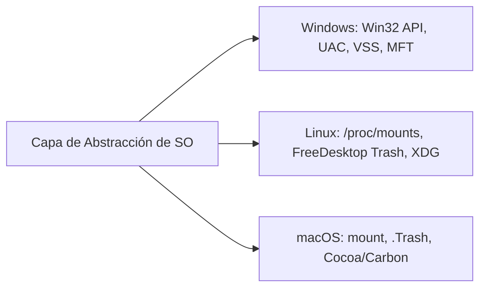

# 💻 Manual de Desarrollo y Guía de Portabilidad

Esta guía está diseñada para **desarrolladores de software, ingenieros de sistemas y contribuidores** que deseen ampliar las capacidades de la suite, agregar nuevos formatos de archivo, implementar parsers estructurales o portar la herramienta a otros sistemas operativos (como macOS, FreeBSD o distribuciones embebidas de Linux).

---

## 1. Principios de Diseño y Arquitectura de Código

El proyecto sigue una arquitectura modular desacoplada:
* **`core/` (Lógica Pura y Forense):** Módulos independientes de la interfaz gráfica. No deben importar ningún componente de `PyQt5`. Trabajan exclusivamente con tipos de datos estándar de Python (`dict`, `list`, `bytes`, `typing`), lo que facilita pruebas unitarias automatizadas y ejecuciones en modo consola/CLI.
* **`ui/` (Presentación Qt):** Consume las clases de `core/` a través de hilos de trabajo asíncronos (`worker.py`). Toda comunicación entre la lógica intensiva y la interfaz se realiza mediante el sistema de **Señales y Slots (`pyqtSignal`)**, garantizando que el hilo principal de la UI (`MainThread`) mantenga una tasa de 60 FPS sin bloqueos.
* **Inmutabilidad de Fuentes:** Los motores de lectura siempre deben abrir archivos y flujos de disco en modo binario de solo lectura (`"rb"`). **Bajo ninguna circunstancia se debe escribir en los volúmenes analizados.**

---

## 2. Arquitectura de Hilos Asíncronos (`ui/worker.py`)

La clase `ScanWorker(QThread)` encapsula la ejecución del escaneo en segundo plano:

```python
class ScanWorker(QThread):
    telemetry_updated = pyqtSignal(str, int, int, int, str) # msg, pct, count, bytes, target
    finished_scan = pyqtSignal(list)                        # items encontrados
    error_occurred = pyqtSignal(str)                        # mensaje de error
```

### Ciclo de Telemetría:
1. El hilo reporta periódicamente a través de `telemetry_updated`.
2. La señal se conecta con `InfoBar.update_status()` en `main_window.py`.
3. `InfoBar` recalcula dinámicamente el tiempo transcurrido, velocidad en MB/s y contadores por categoría.

---

## 3. Guía Paso a Paso: Cómo Agregar un Nuevo Formato de Archivo

Supongamos que deseas agregar soporte para archivos de modelo 3D **Blender (`.blend`)**.

### Paso 1: Registrar el formato en el catálogo de UI (`ui/popups.py`)
Abre `ui/popups.py` y agrega la definición en la categoría correspondiente (o una nueva):
```python
# En DOCUMENT_FORMAT_CATALOG o en una nueva lista:
{"ext": ".blend", "label": "3D Blender Project", "icon": "🎨", "suite": "3D", "desc": "Proyecto de animación y modelado 3D Blender"}
```

### Paso 2: Registrar la extensión en las categorías de Papelera (`core/recycle_bin.py`)
Abre `core/recycle_bin.py` y añade la extensión a `EXT_CATEGORIES`:
```python
EXT_CATEGORIES = {
    # ...
    "Otros": {..., ".blend"},
    # O crea una categoría "3D": {".blend", ".obj", ".fbx", ".stl"}
}
```

### Paso 3: Agregar la firma binaria estática en `core/file_carver.py`
Abre `core/file_carver.py` y agrégala a `SIGNATURE_CATALOG`:
```python
{
    "name": "Blender 3D Project", 
    "ext": ".blend", 
    "cat": "Otros", 
    "header": b"BLENDER",  # Cabecera mágica de Blender
    "footer": None, 
    "max": 500 * 1024 * 1024  # Tamaño máximo razonable (500 MB)
}
```

---

## 4. Guía Paso a Paso: Cómo Implementar un Parser Estructural Matemático

Si el nuevo formato tiene una estructura interna navegable (como un contenedor o bloques de longitud variable), es preferible implementar un parser estructural para recuperar el archivo con un 100% de integridad sin basarse en tamaños fijos.

### Estructura de la función en `core/file_carver.py`:
```python
def parse_mi_formato_structure(data: bytes, offset: int) -> Optional[Tuple[int, Dict[str, Any], int, str]]:
    """
    Analiza la estructura interna del formato.
    Retorna: (longitud_bytes, diccionario_specs, score_integridad, estado_integridad)
    o None si la estructura está corrompida.
    """
    if len(data) - offset < 8:
        return None
    
    # 1. Validar Magic Bytes
    if data[offset:offset+4] != b"MI_MAGIC":
        return None
    
    # 2. Leer longitud declarada en cabecera (Big-Endian o Little-Endian)
    file_size = struct.unpack("<I", data[offset+4:offset+8])[0]
    
    # 3. Validar consistencia matemática
    if file_size <= 8 or file_size > 200 * 1024 * 1024:
        return None
        
    specs = {"format": "MI_FORMATO", "version": 1}
    score = 100
    status = "Íntegro (100%)"
    
    return file_size, specs, score, status
```

Luego, en el bucle principal de `scan_stream()`, se invoca la función para delimitar el archivo exacto.

---

## 5. Guía de Portabilidad a Otros Sistemas Operativos

La suite está diseñada para ser portable con mínimos cambios:



### 5.1 Enumeración de Discos (`core/disk_utils.py`)
Actualmente implementa dos ramas:
* **Windows:** Utiliza `ctypes.windll.kernel32.GetLogicalDrives()` y `GetVolumeInformationW`.
* **Linux:** Lee `/proc/mounts` filtrando sistemas de archivos virtuales (`sysfs`, `proc`, `tmpfs`) y detecta particiones en `/run/media/$USER` y `/media`.

**Para portar a macOS:**
En macOS, los discos montados se consultan leyendo el directorio `/Volumes/` o ejecutando `diskutil list -plist`:
```python
if sys.platform == "darwin":
    volumes = os.listdir("/Volumes")
    for vol in volumes:
        vol_path = os.path.join("/Volumes", vol)
        # Extraer espacio libre con os.statvfs(vol_path)
```

### 5.2 Papelera de Reciclaje (`core/recycle_bin.py`)
* **Windows:** `$Recycle.Bin\<SID>\$I*` y `$R*`.
* **Linux:** `~/.local/share/Trash/files/` y `~/.local/share/Trash/info/*.trashinfo`.
* **macOS:** `~/.Trash` para la papelera de usuario y `/.Trashes/<UID>` para volúmenes secundarios.

### 5.3 Mapeo de Carpetas de Usuario (`core/context_router.py`)
* En Linux y macOS se utiliza la variable de entorno `$HOME` junto a las rutas estándar XDG / Apple Library (`~/Documents`, `~/Downloads`, `~/Pictures`, `~/Music`, `~/Movies`, `~/Desktop`).

---

## 6. Pruebas Automatizadas y Verificación de Calidad

El proyecto incluye una amplia batería de pruebas unitarias en `tests/` y `scratch/`:

### 6.1 Ejecutar Suite Central Forense
```powershell
python tests/test_core.py
```
Verifica:
1. Enumeración de unidades físicas y detección de permisos de administrador.
2. Ruteo contextual y sugerencia de carpetas por tipo de archivo.
3. Catálogo de exclusión de software y juegos (`SoftwareFilter`).
4. Parser de papelera de reciclaje y extracción de `$R`.
5. Extracción de fotos desde `thumbcache_*.db`.
6. File Carving estructural de PNG, JPEG, MP4 y ZIP.
7. Parser de registros de Master File Table (MFT).
8. Gestor de sesiones, serialización Base64 y fusión incremental con huellas digitales (*fingerprints*).
9. Analizador de integridad, ratio de nulos y cálculo de entropía de Shannon.

### 6.2 Ejecutar Suite de Catálogo de 82 Formatos
```powershell
python scratch/test_all_category_formats.py
```
Verifica que las 4 categorías (Imágenes, Documentos, Multimedia y Comprimidos) mantengan sincronización exacta entre los catálogos de la interfaz y los filtros del motor de escaneo.

### 6.3 Ejecutar Prueba de Selección Aislada y Medidor
```powershell
python scratch/test_selection_and_carving_ids.py
```
Verifica que al aplicar filtros visuales y pulsar `Solo Visibles`, el medidor de peso aclare la selección sin sumar archivos ocultos en segundo plano.

