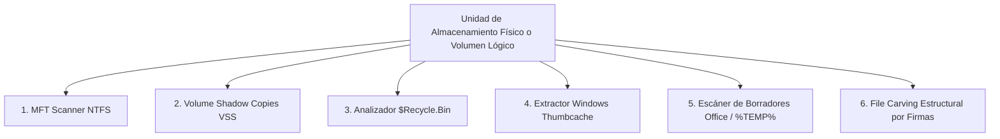

# 🔬 Manual de Uso Técnico y Forense

Este manual está dirigido a **administradores de sistemas, especialistas en soporte técnico avanzado y peritos informáticos forenses**. Detalla los fundamentos físicos y lógicos de los protocolos de recuperación, los algoritmos matemáticos de validación estructural y las directrices periciales para la preservación de evidencias.

---

## 1. Fundamentos de los 6 Protocolos Forenses

### 1.1 Analizador de Master File Table (`core/mft_scanner.py`)
* **Mecanismo:** En sistemas de archivos NTFS, la estructura de cada fichero o directorio está definida en un registro de **1024 bytes** dentro del metarchivo `$MFT`.
* **Detección de registros eliminados:** El offset `0x16` del registro contiene una bandera de 2 bytes (flags):
  * `0x0001`: Archivo en uso.
  * `0x0000`: Archivo marcado como **eliminado** (sus clusters en disco quedan marcados como libres para ser reasignados).
* **Extracción de Atributos:**
  * `$STANDARD_INFORMATION (0x10)`: Extrae marcas de tiempo temporales originales de 64 bits (MACB: Modificado, Accesado, Creado, MFT modificado).
  * `$FILE_NAME (0x30)`: Extrae el nombre de archivo original en codificación UTF-16LE y el puntero al directorio padre.
  * `$DATA (0x80)`: Si el tamaño del fichero es menor a ~700 bytes, los datos son **residentes** dentro del propio registro MFT, permitiendo una recuperación 100% garantizada e íntegra aun cuando los clusters de datos del volumen hayan sido sobreescritos.

### 1.2 File Carving Estructural Avanzado (`core/file_carver.py`)
A diferencia de los talladores primitivos basados exclusivamente en buscar firmas iniciales (Magic Bytes) y asumir tamaños fijos, este motor implementa **validación matemática de estructuras de contenedor**:

* **JPEG (Anti-Truncamiento de Miniatura EXIF):**
  * *Patología forense común:* Las fotos tomadas por cámaras y smartphones contienen una miniatura incrustada en el bloque `APP1` delimitada por marcadores `\xFF\xD8 ... \xFF\xD9`. Los talladores genéricos se detienen en el primer marcador `\xFF\xD9`, recuperando una miniatura degradada de 12 KB y perdiendo la fotografía real de alta resolución.
  * *Algoritmo implementado:* Nuestro parser recorre la secuencia formal de marcadores de longitud variable (`SOI`, `APP0-15`, `DQT`, `DHT`, `SOF0`, `SOF2`). Ignora cualquier `\xFF\xD9` antes del bloque `SOS` (*Start of Scan*). Dentro del flujo comprimido de entropía maneja el escape de bytes (*byte stuffing* `\xFF\x00`) y los marcadores de reinicio (`RST0` a `RST7`), asegurando que la imagen se cierre únicamente en el auténtico `EOI` (*End of Image*) final.
* **PNG (Validación de Chunks y Suma CRC32):**
  * Navega la secuencia obligatoria de chunks de 4 partes: Longitud (4B) + Tipo (4B) + Datos (NB) + CRC32 (4B).
  * Calcula el algoritmo matemático de redundancia cíclica CRC32 sobre Tipo + Datos y lo contrasta con el valor almacenado en cada bloque.
  * Finaliza en el chunk `IEND` (`\x49\x45\x4E\x44\xAE\x42\x60\x82`), garantizando archivos completos sin artefactos visuales ni franjas grises.
* **MP4 / MOV (Jerarquía de Cajas ATOM):**
  * Analiza la jerarquía de cajas ISO/IEC 14496-12: `ftyp`, `moov`, `mvhd`, `tkhd`, `mdat`, `free`.
  * Extrae dimensiones de video (resolución hasta 4K/8K), escala de tiempo y duración exacta en segundos.
  * Verifica la presencia conjunta del átomo de índice de fotogramas (`moov`) y el flujo continuo de audio/video (`mdat`), descartando contenedores corruptos que no sean reproducibles.
* **RIFF / WAV / WebP / AVI:**
  * Interpreta cabeceras RIFF (`Resource Interchange File Format`) de 12 bytes: `RIFF` (4B) + `TamañoArchivo - 8` (4B Little Endian) + `Formato` (4B).
  * En archivos WAV, extrae canales de audio, frecuencia de muestreo (Hz) y bits por muestra.
  * En WebP, valida bloques de compresión con pérdida (`VP8`), sin pérdida (`VP8L`) y cabeceras extendidas (`VP8X`).
* **Documentos OOXML y ODF (ZIP Estructural):**
  * Detecta firmas de cabecera local `PK\x03\x04` y rastrea hacia el final del flujo el registro de directorio central `EOCD` (`PK\x05\x06`).
  * Inspecciona el índice interno sin extraer en disco para clasificar el documento:
    * `word/document.xml` $\rightarrow$ Microsoft Word (`.docx`).
    * `xl/workbook.xml` $\rightarrow$ Microsoft Excel (`.xlsx`).
    * `ppt/presentation.xml` $\rightarrow$ Microsoft PowerPoint (`.pptx`).
    * `mimetype` con `application/vnd.oasis.opendocument.*` $\rightarrow$ LibreOffice (`.odt`, `.ods`, `.odp`).
  * Extrae muestras de texto real desde los nodos XML para verificar legibilidad y generar previsualizaciones directas.

### 1.3 Copias de Sombra de Volumen VSS (`core/shadow_explorer.py`)
* **Principio:** Windows crea instantáneas a nivel de bloque (Volume Shadow Copies) antes de actualizaciones críticas, puntos de restauración o mediante el servicio de Historial de Archivos.
* **Utilidad Forense:** Si un archivo fue modificado, infectado por ransomware o sobreescrito intencionalmente en el volumen en vivo, el motor consulta las instantáneas VSS para extraer la versión previa íntegra del archivo a partir de los bloques diferenciales preservados en el almacenamiento de instantáneas (`System Volume Information`).

### 1.4 Papelera Forense y Rescate de Huérfanos (`core/recycle_bin.py`)
* **Estructura:** Analiza carpetas ocultas `$Recycle.Bin\<SID_Usuario>\`.
* **Pares de Archivos:**
  * `$I<ID_Aleatorio>.<ext>`: Archivo de cabecera de metadatos (tamaño 544 bytes en Windows Vista/7 o variable en Windows 10/11). Contiene la ruta original completa codificada en UTF-16, fecha exacta de eliminación en formato FILETIME y tamaño original del archivo.
  * `$R<ID_Aleatorio>.<ext>`: Contenedor físico con los datos reales del archivo.
* **Rescate de Huérfanos `$R`:** Si el usuario o una herramienta de limpieza (como CCleaner) borró los índices `$I`, el motor escanea los contenedores `$R` huérfanos, analiza sus números mágicos y determina su tipo y contenido, recuperando archivos que otros programas dan por perdidos.

### 1.5 Extractor de Windows Thumbcache (`core/thumbcache_extractor.py`)
* **Ubicación:** `%LOCALAPPDATA%\Microsoft\Windows\Explorer\thumbcache_*.db`.
* **Utilidad Forense:** Windows almacena copias de mapa de bits de todas las imágenes vistas en el explorador en resoluciones de 32, 96, 256, 1024, 1280, 1920 y hasta 2560 píxeles.
* **Procedimiento:** Parsea la estructura de registros de la base de datos binaria `thumbcache`, extrae el encabezado y volcado JPEG/PNG de cada miniatura. Permite recuperar evidencia fotográfica crucial aun después del formateo rápido de particiones secundarias o sobreescritura del archivo original.

### 1.6 Borradores de Office y Archivos Temporales (`core/temp_scanner.py`)
* **Rastreo:** Inspecciona `%TEMP%`, `%LOCALAPPDATA%\Temp`, `%APPDATA%\Microsoft\Word`, etc.
* **Archivos AutoRecover:** Localiza archivos `.asd` (AutoRecuperación de Word), `.wbk` (Respaldos automáticos de Word), `.xar` (AutoRecuperación de Excel) y archivos temporales de escritura atómica con cabeceras OLE2/OOXML que los usuarios no alcanzaron a guardar antes de cortes de energía o caídas del sistema.

---

## 2. Métricas de Integridad y Diagnóstico Forense

El módulo `core/integrity_analyzer.py` aplica fórmulas estadísticas para evaluar cada hallazgo:

### 2.1 Ratio de Bytes Nulos
Calcula la proporción de bytes con valor cero (`0x00`) en la muestra inicial:
$$\text{Null Ratio} = \frac{\text{Conteo de } 0x00}{\text{Longitud de Muestra}}$$
* **Interpretación:** Si $\text{Null Ratio} > 0.85$ (más del 85% de ceros), se clasifica como bloque desasignado o sector libre borrado por el sistema operativo. Se descarta automáticamente con estado `🔴 Inútil (5%)`.

### 2.2 Entropía de Información de Shannon
Calcula el nivel de aleatoriedad o sorpresa en la distribución de frecuencias de los bytes:
$$H(X) = -\sum_{i=0}^{255} P(x_i) \log_2 P(x_i)$$
* **$H(X) \approx 0.0$ bits/byte:** Patrones altamente repetitivos (secuencias continuas de `0x00`, `0xFF` o caracteres idénticos). Basura lógica.
* **$3.5 < H(X) < 5.5$ bits/byte:** Texto plano legible, código fuente, XML, JSON, código máquina no comprimido.
* **$7.0 < H(X) < 8.0$ bits/byte:** Datos con compresión matemática eficiente o cifrado (imágenes JPEG, archivos ZIP/RAR/7Z, video MP4, flujos HTTPS/TLS).

---

## 3. Metodología de Intervención en Discos Inestables

Cuando se trabaja con discos duros mecánicos con sectores defectuosos (*bad sectors*), unidades con cabezales inestables o memorias flash degradadas:

1. **Minimizar Desplazamientos Mecánicos (*Head Thrashing*):**
   * Active el **Filtro de Software y Juegos (`SoftwareFilter`)**: Omitirá decenas de miles de archivos irrelevantes de programas instalados, reduciendo el estrés físico del cabezal de lectura en más de un 80%.
   * Utilice **Indexación Dirigida o Selector Manual**: Limite la búsqueda exclusivamente a las carpetas donde se encontraban los datos sensibles.
2. **Escaneos Incrementales con Persistencia de Sesiones:**
   * Si el disco corre riesgo inminente de fallo físico, realice búsquedas por fases (ej. primero Documentos, guarde la sesión en `sessions/`; luego Fotos).
   * La función de **Escaneo Incremental** en `SessionManager` calculará huellas digitales (*fingerprints*) y no volverá a leer clusters de archivos ya identificados.
3. **Regla Estricta de Escritura:**
   * La unidad bajo análisis se debe montar siempre en modo de **solo lectura**.
   * El directorio de guardado debe ser una unidad física externa independiente con capacidad suficiente para albergar el volumen total recuperado.

---

## 4. Cadena de Custodia y Auditoría Criptográfica

Para garantizar la validez pericial de los archivos recuperados:
* Al ejecutar la exportación mediante `RecoveryExporter`, el sistema calcula el hash criptográfico **SHA-256** de cada archivo restaurado.
* Se genera un archivo de auditoría `recovery_audit_log.txt` con marcas de tiempo ISO-8601, ruta original, método de procedencia y firma hash, permitiendo contrastar la integridad de la evidencia en sede judicial.

