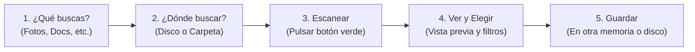

# 📖 Manual de Uso para Usuarios Comunes

Bienvenido al manual de usuario del **Recuperador de Datos Forense**. Esta guía está escrita en un lenguaje sencillo y directo para ayudarte a encontrar y restaurar archivos que hayas borrado por error, documentos que no se guardaron, o fotos perdidas en tu equipo o memoria USB.

---

## ⚠️ La Regla de Oro de la Recuperación de Datos

> [!CAUTION]
> **NUNCA guardes los archivos recuperados en el mismo disco donde se perdieron.**  
> Si estás recuperando archivos del **Disco Local (C:)**, debes elegir como carpeta de guardado una **Memoria USB, Disco Externo o una unidad diferente (ejemplo: D:)**.  
> **¿Por qué?** Cuando un archivo se borra, sus datos siguen en el disco hasta que algo nuevo se escribe encima. Si guardas archivos recuperados en el mismo disco, podrías sobreescribir y destruir los mismos archivos que estás intentando salvar.

---

## 🚀 Guía Rápida en 5 Pasos

---

### Paso 1: Elige qué tipo de archivos deseas recuperar

En la parte izquierda de la pantalla verás el botón desplegable **`📁 Tipos de Archivo`**:

1. Haz clic en **`📁 Tipos de Archivo...`** para abrir la ventana de selección.
2. Verás 4 pestañas:
   * **📄 Documentos / Office:** Archivos Word, Excel, PowerPoint, PDF, texto y más.
   * **🖼️ Fotos e Imágenes:** Fotografías JPG, PNG, archivos de Photoshop, etc.
   * **🎬 Audio y Video:** Canciones MP3, notas de voz, videos MP4, grabaciones.
   * **📦 Comprimidos:** Archivos ZIP, RAR, 7Z.
3. **¿Tienes prisa? Usa los botones rápidos:**
   * Haz clic en **`[📘 Solo Office]`** si solo buscas documentos de trabajo de Word o Excel.
   * Haz clic en **`[📕 Solo PDF]`** si buscas contratos o libros digitales.
   * Haz clic en **`[✔ Todos]`** si deseas buscar cualquier tipo de archivo.
4. Pulsa **`Aceptar`**.

---

### Paso 2: Elige dónde buscar (Alcance)

En la sección **`3. ALCANCE: CARPETAS Y UBICACIONES PARA RECUPERACIÓN`**, verás directamente un **listado interactivo con casillas de verificación**:

* **Carpetas Recomendadas (`🎯`):** El programa marca automáticamente las carpetas más lógicas según lo que buscas (por ejemplo, si buscas fotos, marcará *Mis Imágenes* y la caché del sistema; si buscas documentos, marcará *Mis Documentos* y *Descargas*).
* **Marcar / Desmarcar Carpetas:** Haz clic directamente en la casilla de cualquier carpeta o unidad (`💽`) para incluirla o excluirla de la búsqueda.
* **`[➕ Añadir...]`**: Si tu archivo estaba en una carpeta especial o disco externo, pulsa este botón para agregar cualquier carpeta de tu equipo a la lista.
* **Botones Rápidos:**
  * **`[🎯 Recomendadas]`**: Vuelve a marcar las carpetas aconsejadas para los tipos de archivo activos.
  * **`[✔ Todas]`**: Marca todas las carpetas y unidades del listado.
  * **`[✖ Ninguna]`**: Desmarca todas las ubicaciones para que elijas solo una en específico.

---

### Paso 3: Inicia el escaneo

1. Pulsa el botón verde grande **`🚀 INICIAR ESCANEO PROFUNDO`**.
2. En la parte superior de la ventana verás una barra de progreso que te informará:
   * Cuántos megabytes por segundo se están analizando.
   * Qué archivo o sector se está examinando en ese instante.
   * El número de archivos encontrados hasta el momento.
3. Puedes detener el escaneo en cualquier momento pulsando **`⏹ CANCELAR`**; los archivos encontrados hasta ese instante se mantendrán en pantalla.

---

### Paso 4: Revisa los resultados y usa la Vista Previa

Al terminar el escaneo, la tabla central mostrará todos los archivos recuperables:

1. **Cómo saber si un archivo sirve (Semáforo de Calidad):**
   * 🌟 **Verde (Alta Calidad):** El archivo está 100% íntegro, no está dañado y se puede abrir sin problemas.
   * 🟡 **Amarillo (Calidad Media):** El archivo es utilizable, aunque puede tener resolución moderada.
   * 🟠 **Naranja (Baja Calidad):** Archivo muy fragmentado o degradado.
   * 🔴 **Rojo (Inútil / Basura):** Sectores vacíos o falsas alarmas que no contienen datos reales.
   > **Consejo:** Puedes pulsar el botón verde **`🌟 Solo Alta Calidad`** arriba de la tabla para desmarcar automáticamente toda la basura y seleccionar solo lo que sirve.

2. **Panel de Vista Previa (A la derecha):**
   * Haz clic sobre cualquier archivo de la tabla para previsualizarlo:
     * **Fotos:** Puedes ver la imagen completa, hacer zoom con la rueda del ratón y ver la fecha de la cámara.
     * **Videos y Música:** Cuenta con un reproductor integrado para escuchar la canción o ver el video antes de recuperarlo.
     * **Documentos Word/Excel/PDF:** Muestra el texto y párrafos que contenía el documento.

3. **Filtros rápidos:**
   * Usa la casilla **`🔍 Buscar por nombre...`** para escribir una palabra clave.
   * Si solo quieres ver los archivos que coinciden con tu búsqueda, pulsa el botón **`✔ Solo Visibles`**.

---

### Paso 5: Guarda tus archivos recuperados

1. En la parte inferior de la ventana, revisa la casilla **`📁 Carpeta de Guardado`**.
2. Pulsa **`Cambiar Destino...`** y selecciona una carpeta en **otra unidad o memoria USB**.
3. Opciones útiles activadas por defecto:
   * **Restaurar con Nombres Originales:** Intenta devolverle al archivo su nombre real (ejemplo: `Presupuesto_2026.docx` en vez de un nombre temporal raro).
   * **Reconstruir Árbol de Carpetas:** Vuelve a crear la estructura de carpetas donde estaba guardado para que no tengas todos los archivos desordenados en una sola carpeta.
4. Pulsa el botón grande **`💾 RECUPERAR SELECCIONADOS`**.
5. Aparecerá una barra de progreso que copiará y verificará cada archivo en tu carpeta de destino.
6. ¡Listo! Al terminar se abrirá automáticamente la carpeta con tus archivos rescatados.

---

## ❓ Preguntas Frecuentes de Usuarios

### 1. ¿Por qué algunos archivos tienen nombres como `Recuperado_0042.jpg`?
Cuando un archivo se elimina y se vacía la papelera, el sistema de archivos borra el nombre original del índice de Windows. El programa rescata el contenido leyendo directamente los sectores del disco (tallado o *carving*). Aunque el nombre se haya perdido, el contenido de la foto o video está intacto.

### 2. ¿El programa borra o modifica algo en mi disco?
**No, nunca.** El Recuperador de Datos funciona en modo de **solo lectura**. No altera, no modifica ni escribe nada sobre el disco que está siendo escaneado para garantizar que tus datos estén 100% protegidos.

### 3. ¿Puedo cerrar el programa y continuar después?
**Sí.** Pulsa el botón **`💾 Guardar Sesión Actual`** en la esquina superior derecha. Puedes asignarle un nombre (ej. `Escaneo USB Trabajo`). Cuando vuelvas a abrir el programa, pulsa **`📂 Sesiones Guardadas...`** y tus resultados volverán a aparecer al instante sin necesidad de volver a esperar el escaneo.

### 4. ¿Cómo empiezo una búsqueda nueva o borro los resultados anteriores?
Pulsa el botón **`➕ Nueva Sesión`** (o el atajo **`Ctrl+N`**) en la barra superior. Esto cerrará de forma segura cualquier escaneo en marcha, limpiará la tabla de resultados, vaciará la vista previa y reiniciará los filtros para que comiences desde cero. Si tienes archivos encontrados, la aplicación te preguntará amablemente si deseas guardarlos antes de limpiar. Si deseas borrar las sesiones viejas guardadas en disco, puedes pulsar **`📂 Sesiones Guardadas...`** y seleccionar **`🧹 Purgar Todo...`**.

### 5. ¿Por qué el programa no muestra los archivos que ya existen en mis carpetas?
El Recuperador de Datos cuenta con una política estricta de **solo datos perdidos**. Omite automáticamente todos los archivos que ya existen saludables y activos en tus discos para no saturar tu pantalla con gigabytes de información que ya tienes disponible. Únicamente indexa y muestra elementos que se encuentran en **estado de recuperación** (archivos de la papelera `$Recycle.Bin`, registros eliminados en la tabla NTFS `$MFT`, borradores huérfanos de Office no guardados, instantáneas de volumen o archivos extraídos de imágenes forenses).

